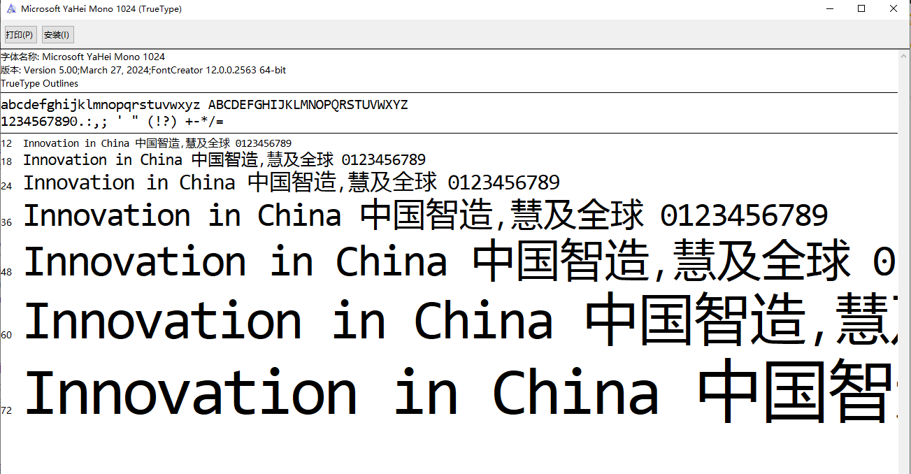
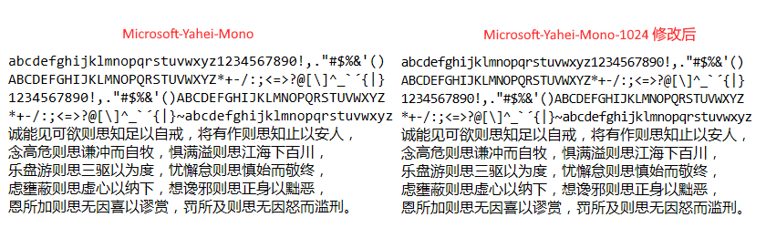

# Microsoft-Yahei-Mono-1024
Microsoft Yahei Mono 字体

个人喜欢的字体，基于[chenyium的版本](https://github.com/chenyium/Microsoft-Yahei-Mono)的修改。

网友byzod基于chenyium的版本做了[修改](https://github.com/byzod/Microsoft-Yahei-Consolas)，主要字母和数字的宽度从1126变成1024，正好是全宽汉字2048的一半。经过我实测显示不完美。

效果如下：




我的改动如下：

- 修改`0`, 中间斜杠改为原点。

- 修改`l`, 跟1很像，不好区分，去掉下面左侧半横，借用't'的尾巴。

- 调整下面宽度为1024，对于原来全宽字母符号2048没变

````
abcdefghijklmnopqrstuvwxyz
ABCDEFGHIJKLMNOPQRSTUVWXYZ
1234567890!,."#$%&'()
*+-/:;<=>?@[\]^_`´{|}~
诚能见可欲则思知足以自戒，将有作则思知止以安人，
念高危则思谦冲而自牧，惧满溢则思江海下百川，
乐盘游则思三驱以为度，忧懈怠则思慎始而敬终，
虑壅蔽则思虚心以纳下，想谗邪则思正身以黜恶，
恩所加则思无因喜以谬赏，罚所及则思无因怒而滥刑。
````

效果：


