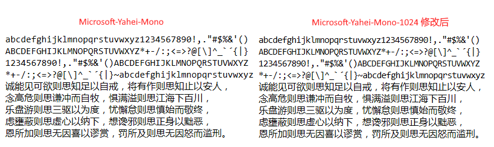

# 编程字体
收集和修改一些编程字体。
Releases中汇总了Regular类型的字体。

## 推荐
### [Microsoft-Yahei-Mono-1024](./Microsoft-Yahei-Mono-1024)
适合场景：不能分别设置中文、英文字体的软件。 比如在notepad++中使用

效果：

### [simsun_DejaVu](./simsun_DejaVu)
适合场景：不能分别设置中文、英文字体的软件。 比如在notepad++中使用

效果：

## 安装

方法一： Releases下找到*.otf或*.ttf。

方法二： 单独文件夹下找到*.otf或*.ttf。

下载后，安装即可。

---

## Programming Fonts
Collecting and Modifying Fonts for Coding.
The Releases section aggregates fonts of the Regular type.

## Recommend
[Microsoft-Yahei-Mono-1024](./Microsoft-Yahei-Mono-1024) and [simsun_DejaVu](./simsun_DejaVu)
Suitable Scenario: Software where individual settings for Chinese and English characters are unavailable. 
For instance, usage in Notepad++.

## Installation
Method 1: Locate *.otf or *.ttf files under the Releases section.
Method 2: Find *.otf or *.ttf files within a dedicated folder.
After downloading, proceed to install.
