## 针对FontCreator12汉化版本-帮助文档

### 调整字宽为1024

1.选中

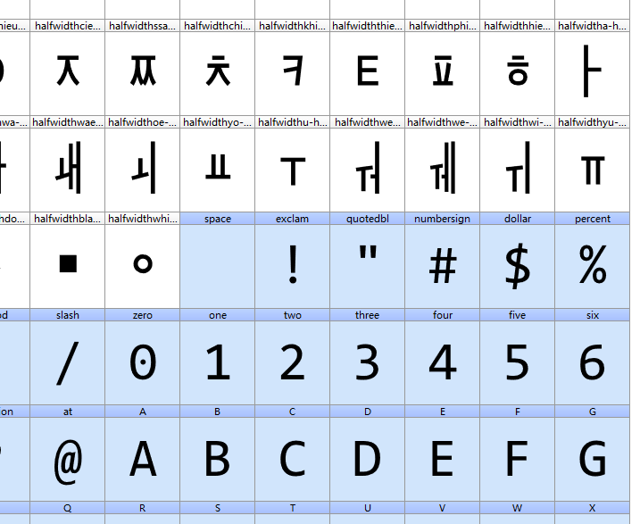

2. 工具 - 自动度量 - 固定字宽

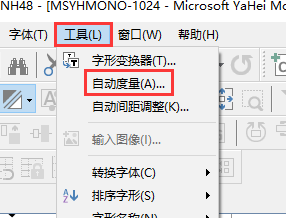

3. 固定字宽，改为1024

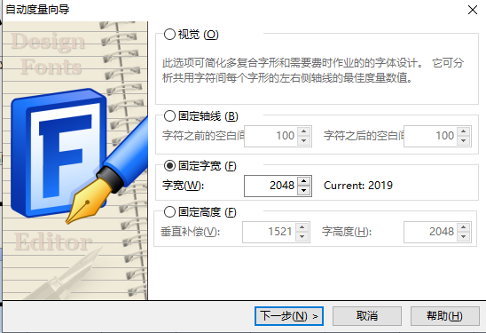

4. 选中要修改的字形。

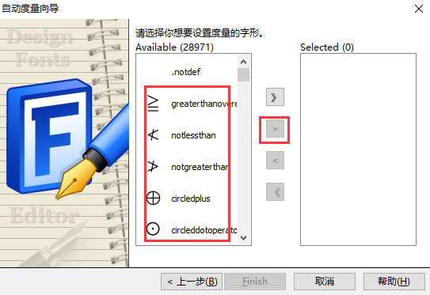

### 字形变换器

工具 - 字形变换器，可以调整很多内容：

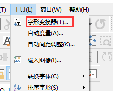

例如：

Outlines - Scale

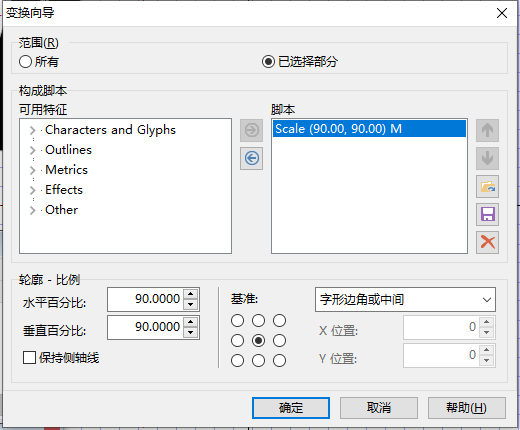

Metrics - Width宽度

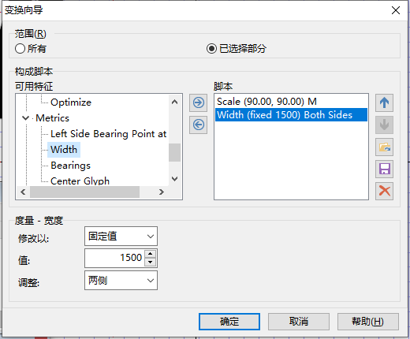

### 调整单个字形，使用变化工具

视图 - 工具栏 - 变换 

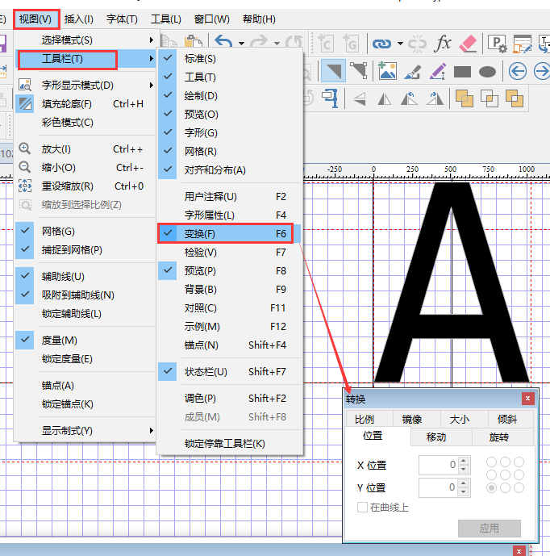

### 字体属性修改

字体 - 属性

最好改一个名字，要不然，可能与系统安装的字体冲突。

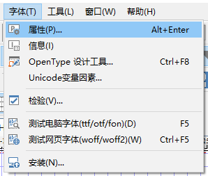

标注符中字体系需要自定义

例如宋体，SimSum，改为SimSun-orig

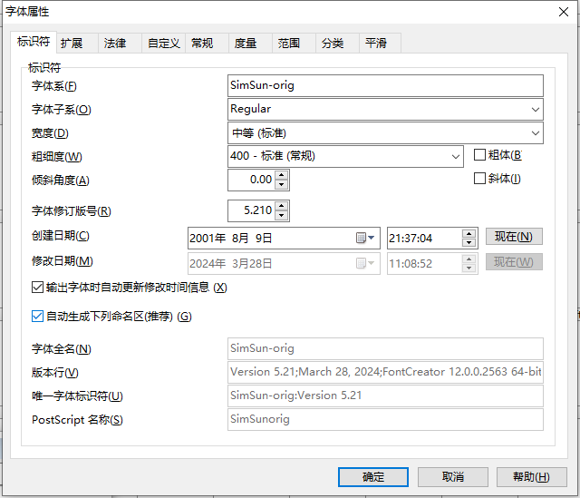

例如：Microsoft YaHei Mono 1024

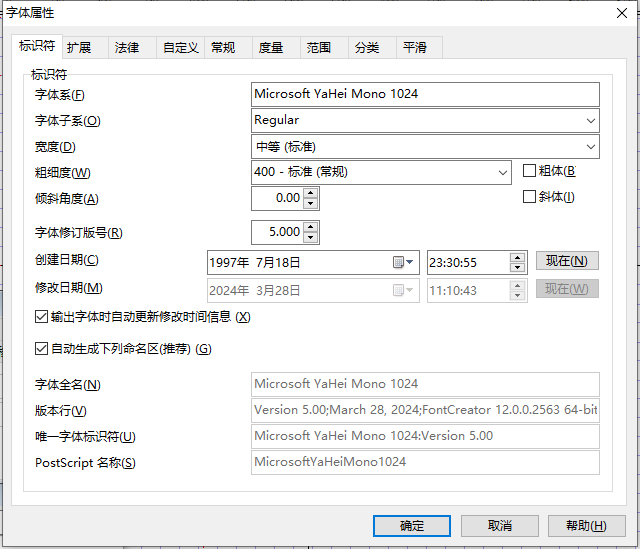

自定义内Font Family需要自定义

例如：宋体改为宋体-orig

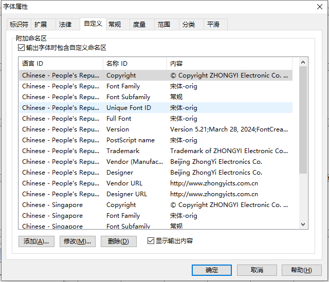

### 输出字体 ttf、otf

文件 - 输出字体

注意：**输出设置** 中 **输出文件** 需要设置一下。

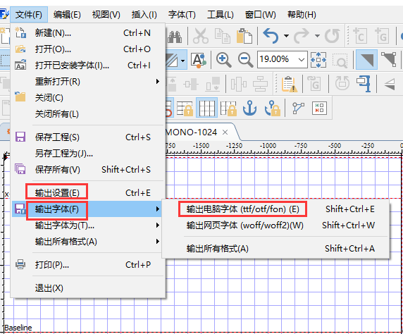

### FontCreator Support

[FontCreator FAQ](https://www.high-logic.com/font-editor/fontcreator/faq) – view the most frequently asked questions (and answers) about FontCreator
[FontCreator Tutorials](https://www.high-logic.com/font-editor/fontcreator/tutorials) – a list of handy tutorials to help you design and edit fonts with FontCreator
[FontCreator User Manual](https://www.high-logic.com/fontcreator/manual15/) – the online version of the FontCreator user manual
